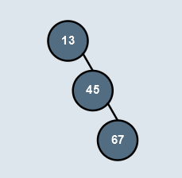

# 
<b>AVL Tree Visualization in JavaFX</b>

  

 
This JavaFX application demonstrates the visualization of an <b>AVL Tree</b> (Adelson-Velsky and Landis Tree), a type of self-balancing binary search tree. The application provides functionalities to insert, search, delete, and perform different tree traversals with visual animations. 
 
 

<i>Dashboard of AVL Tree Visualizer</i>

The AVL Tree maintains a balance factor at each node to ensure the height remains logarithmic, providing efficient operations.
Since the AVL tree is a self-balancing binary tree, so whenever the tree will get unbalanced the balancing algorithm will balance the tree.

The balancing of the tree is taken care by <b>different rotations of AVL Tree</b>. There are two types of rotations of an AVL tree, these are:

1. <b>Left Rotation</b>

    Consider the situation of an tree nodes:

    

    To balance this we perform following operations:
     
    - `45` becomes the new root.
    - `13` takes ownership of `45`'s left child as its right child, or in this case, null.
    - `45` takes ownership of `13` as its left child. 

    Now tree will look like:

    

     
2. <b>Right Rotation</b>

    Consider the situation of an tree nodes:

    

    To balance this we perform following operations:
     
    - `20` becomes the new root.
    - `30` takes ownership of `20`'s right child, as its left child. In this case, that value is null.
    - `20` takes ownership of `30`, as it's right child. 

    Now tree will look like:

    

 
These two rotaions will take care the following four unbalancing cases of AVL Tree.:

1. Left-Left Unbalancing Case 

    This case looks like:

    

    To balance this we'll perform single time right-rotation on `10`.

2. Left-Right Unbalancing Case 

    This case looks like:

    

    To balance this, we'll perform:

    - First, left-rotation on `10`(`left-child of current node`).
    - Then, right-rotation on `20`. 
3. Right-Right Unbalancing Case 

    This case looks like:

    

    To balance this we'll perform single time left-rotation on `30`.
4. Right-Left Unbalancing Case 

    This case looks like:

    

    To balance this, we'll perform:

    - First, right-rotation on `30`(`right-child of current node`).
    - Then, left-rotation on `10`. 

 
So just by performing these rotations we can balance our binary search tree.

## <b>Features</b>

### <b>Text Box</b>
  The node of tree can contain integer value. The integer value can be entered in the given text box, if the value entered will not be valid then it will not accept it. 

  So the user should input the value ranging from `-2,147,483,648` to `2,147,483,647`.

  But for better visualisation try to insert lower integer values.
  

    
  

  
<i>Text Box for giving values</i>

## 1. Operations
- <b>Insertion</b>:

   Add nodes to the AVL Tree, ensuring it remains balanced. Visualize the balancing process with animations.

   Node value can inserted by using `insert` button on left side below the text-box. 
    
    

       
    

    
<i>Button for inserting value</i>

    

       
    

    
<i>Demonstration of using insert button</i>

- <b>Search</b>: 

  Find a node in the tree with visual feedback indicating whether the node exists.

  We can use `search` button to search the value in AVL Tree. The searching will happen by comparing the value to be searched to the value of current node, and according to the value, the search will go to the left or right subtree of an AVL tree.

    

       
    

    
<i>Button for inserting value</i>

    

       
    

    
<i>Demonstration of searching value 80 in AVL Tree</i>

- <b>Deletion</b>: 

  Remove nodes while maintaining the balance of the tree.
  
## 2. <b>Traversals</b>:
  - <b>Inorder</b>: Traverse the tree in an ascending order.
  - <b>Preorder</b>: Traverse the tree in a root-left-right order.
  - <b>Postorder</b>: Traverse the tree in a left-right-root order.
  - <b>Level Order</b>: Traverse the tree level by level.
  - <b>DFS</b>: Perform a depth-first traversal.
- <b>Clear</b>: Reset the AVL Tree to an empty state.
- <b>Visual Feedback</b>: Animations for insertion, deletion, and traversal steps to provide an engaging learning experience.

## <b>Class Details</b>

### <b>AVLTree Class</b>

The `AVLTree` class handles the logic and animation of the AVL tree. Below is a breakdown of the key components and methods:

### <b>Attributes</b>

- <b>START_Y</b>: Initial Y-coordinate of the AVL tree nodes.
- <b>DELTA_X</b>: Horizontal spacing between nodes.
- <b>DELTA_Y</b>: Vertical spacing between levels.
- <b>K</b>: Distance from the center used for calculating the start of edges.
- <b>DIST</b>: Distance from the edge point starting to the perpendicular bisector.

### <b>Constructor</b>

- <b>AVLTree(Pane newPane)</b>: Initializes the AVL Tree with an empty root and sets up the pane for displaying the nodes.

### <b>Core Methods</b>

### <b>Utility Methods</b>

- <b>contains(AVLNode root, int val)</b>: Checks if a node is present in the tree.

- <b>insertUtil(AVLNode root, int val, double centerX, double centerY, boolean isLeft)</b>: A helper function that recursively inserts a node into the correct position in the tree.

- <b>updateNode(AVLNode node)</b>: Updates the height and balance factor of a node.

- <b>balanceTree(AVLNode node)</b>: Balances the AVL tree using rotations.

- <b>leftLeftCase(AVLNode node)</b>: Handles left-left imbalance by performing a right rotation.

- <b>leftRightCase(AVLNode node)</b>: Handles left-right imbalance with a left rotation followed by a right rotation.

- <b>rightRightCase(AVLNode node)</b>: Handles right-right imbalance by performing a left rotation.

- <b>rightLeftCase(AVLNode node)</b>: Handles right-left imbalance with a right rotation followed by a left rotation.

- <b>rightRotate(AVLNode node)</b>: Performs a right rotation on the subtree.

- <b>leftRotate(AVLNode node)</b>: Performs a left rotation on the subtree.

- <b>nodeAppearance(AVLNode newNode)</b>: Animates the appearance of a newly inserted node.

- <b>lineGrowing(Line line, double endX, double endY)</b>: Animates the growth of a line between nodes.

- <b>resizeTree()</b>: Re-adjusts the positions of nodes visually after insertion or deletion to ensure the tree looks balanced.

- <b>setNewPositions(AVLNode node, double xPosition, double yPosition, byte side, double lineStartX, double lineStartY, Line line)</b>: Updates the positions of nodes recursively to maintain the visual structure.

- <b>resizeWidths(AVLNode node)</b>: Calculates and updates the left and right widths of nodes for proper positioning.

## <b>How to Use</b>

1. <b>Insert Nodes</b>: Click the insert button to add nodes to the tree. The tree will automatically balance itself.
2. <b>Search Nodes</b>: Use the search function to locate a specific value in the tree.
3. <b>Delete Nodes</b>: Click the delete button to remove a node and see the balancing in action.
4. <b>Perform Traversals</b>: Choose from different traversal options to see the order of nodes visually.
5. <b>Clear Tree</b>: Reset the tree using the clear function.

## <b>Requirements</b>

- <b>Java Development Kit (JDK) 11 or higher</b>
- <b>JavaFX SDK</b> (included in most modern Java IDEs)

## <b>How to Run</b>

1. Clone the repository.
2. Import the project into your Java IDE (like IntelliJ IDEA, Eclipse with e(fx)clipse).
3. Ensure JavaFX is properly configured in your IDE.
4. Run the main class, which initializes the JavaFX application and displays the AVL Tree visualization.
